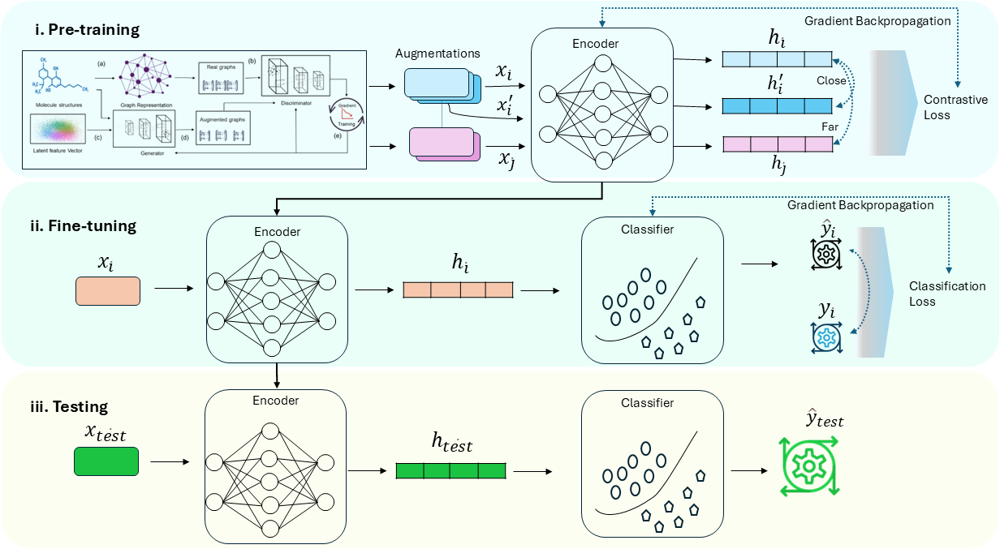
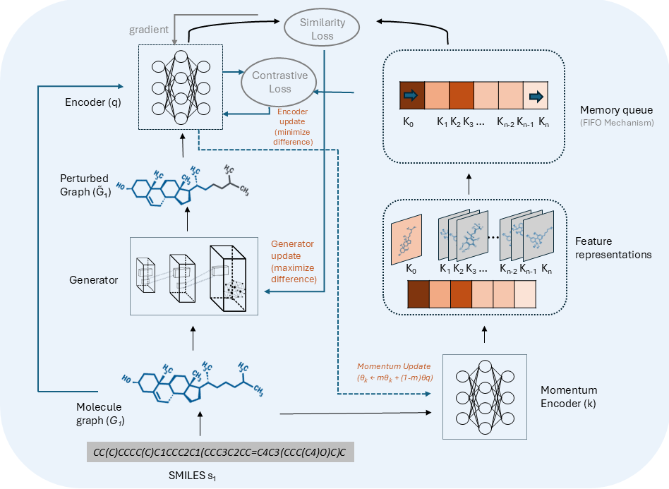

# GMACORE-TM

Reference implementation of **"Self-supervised molecular graph representation learning via stability-aware generative adversarial contrastive learning"**.

Sakhamuri, M. R., Henna, S., Creedon, L., Meehan, K.
Atlantic Technological University, Donegal, Ireland.

---

## Overview

GMACORE-TM is a self-supervised pretraining framework for molecular graphs that addresses two coupled sources of instability in queue-based molecular contrastive learning: the limited adaptability of handcrafted graph augmentations, and the progressive staleness of negative representations stored in a memory queue as the encoder evolves.

### GMACORE Framework

<p align="center">
  
</p>

<p align="center">
  <em>GMACORE generative adversarial contrastive learning framework.</em>
</p>

### GMACORE-TM Framework

<p align="center">
  
</p>

<p align="center">
  <em>GMACORE-TM framework incorporating the momentum encoder and age-weighted memory queue.</em>
</p>

The pipeline is

```
SMILES -> molecular graph -> generative adversarial augmentation
                          -> contrastive learning with a momentum encoder
                          -> age-weighted memory queue
                          -> downstream transfer to MoleculeNet
```

Three variants are implemented in a single framework, so that the comparison between them is an exact ablation:

| Variant | Augmentation | Key encoder | Negative weighting |
| --- | --- | --- | --- |
| `manualaug_cl` | handcrafted (node drop, edge drop, feature mask) | query encoder | uniform |
| `gmacore` | generative adversarial | query encoder | uniform |
| `gmacore_tm` | generative adversarial | momentum (EMA) encoder | age-based exponential decay |

Any difference in outcome between `gmacore` and `gmacore_tm` is attributable to the momentum encoder and the age-based weighting alone.

---

## Repository structure

```
gmacore-tm/
├── configs/                        YAML configurations, one per experiment
│   ├── pretrain_manualaug_cl.yaml
│   ├── pretrain_gmacore.yaml
│   ├── pretrain_gmacore_tm.yaml
│   ├── finetune_classification.yaml
│   └── finetune_regression.yaml
├── scripts/                        command line entry points
│   ├── pretrain.py
│   ├── finetune.py
│   ├── download_moleculenet.py
│   ├── extract_embeddings.py
│   ├── analyze_representations.py
│   └── run_all.sh
├── src/gmacore/
│   ├── data/                       featurization, MoleculeNet loaders, splits
│   ├── models/                     encoder, generator, memory queue, framework
│   ├── losses/                     InfoNCE, age-weighted InfoNCE, adversarial
│   ├── training/                   pretraining and fine-tuning loops
│   ├── evaluation/                 metrics and representation-space analysis
│   └── utils/                      configuration, logging, seeding, checkpoints
├── tests/                          unit tests
├── docs/                           installation, reproduction, design notes
└── notebooks/                      exploratory notebook (not the entry point)
```

---

## Installation

```bash
git clone https://github.com/MallikharjunaSakhamuri/GMACORETM.git
cd GMACORETM

conda env create -f environment.yml
conda activate gmacore-tm
pip install -e .
```

PyTorch Geometric wheels must match the installed PyTorch and CUDA versions. See [`docs/INSTALL.md`](docs/INSTALL.md) for the version matrix and a CPU-only alternative.

Verify the installation:

```bash
pytest
```

---

## Data

**Pretraining corpus.** A newline-delimited file of SMILES strings. The reported results use the ChemBERTa-compiled PubChem collection. Place it at `data/pubchem/pubchem_10m_clean.txt` or point `data.smiles_file` at your own copy.

**Downstream benchmarks.**

```bash
python scripts/download_moleculenet.py --all
```

This writes the benchmark CSV files to `data/moleculenet/`. Files that cannot be fetched automatically can be obtained from [moleculenet.org/datasets](https://moleculenet.org/datasets).

---

## Usage

### Pretraining

```bash
python scripts/pretrain.py --config configs/pretrain_gmacore_tm.yaml
python scripts/pretrain.py --config configs/pretrain_gmacore.yaml
python scripts/pretrain.py --config configs/pretrain_manualaug_cl.yaml
```

Any configuration value can be overridden on the command line, which is useful for a short smoke run before committing to the full schedule:

```bash
python scripts/pretrain.py --config configs/pretrain_gmacore_tm.yaml \
    --set pretrain.epochs=2 data.limit=1000 pretrain.device=cpu
```

Each run writes checkpoints, per-epoch embeddings, a training history and a resolved configuration to `pretrain.output_dir`.

### Downstream evaluation

```bash
python scripts/finetune.py --config configs/finetune_classification.yaml \
    --checkpoint runs/gmacore_tm/best_model.pt

python scripts/finetune.py --config configs/finetune_regression.yaml \
    --checkpoint runs/gmacore_tm/best_model.pt
```

Two transfer protocols are available. `finetune` trains the encoder and head jointly and produces the headline results; `linear_probe` freezes the encoder and trains the head alone, which isolates representation quality from fine-tuning capacity:

```bash
python scripts/finetune.py --config configs/finetune_classification.yaml \
    --checkpoint runs/gmacore_tm/best_model.pt \
    --set finetune.protocol=linear_probe
```

A randomly initialized encoder gives the no-pretraining control:

```bash
python scripts/finetune.py --config configs/finetune_classification.yaml --no-pretrain
```

Results are written as JSON with per-seed runs and a `mean +/- standard deviation` summary.

### Representation analysis

```bash
python scripts/analyze_representations.py \
    --embedding-dir runs/gmacore_tm/embeddings \
    --output runs/gmacore_tm/representation_analysis.json
```

This reports representation drift, encoder-key alignment, centroid directional consistency and embedding dispersion, which are the quantitative counterparts to the UMAP figures in the paper.

### Full pipeline

```bash
bash scripts/run_all.sh
```

---

## Benchmarks

Classification is scored by ROC-AUC and PR-AUC under a scaffold split; regression by RMSE, MAE and R-squared.

| Benchmark | Task | Tasks | Split | Role |
| --- | --- | --- | --- | --- |
| BACE | classification | 1 | scaffold | reported in the paper |
| BBBP | classification | 1 | scaffold | reported in the paper |
| ClinTox | classification | 2 | scaffold | reported in the paper |
| ESOL | regression | 1 | scaffold | reported in the paper |
| QM9 | regression | 6 | random | reported in the paper |
| HIV | classification | 1 | scaffold | extended evaluation |
| Lipophilicity | regression | 1 | scaffold | extended evaluation |

---

## Implementation notes

Several details of the implementation are easy to get subtly wrong, and are documented in [`docs/DESIGN.md`](docs/DESIGN.md):

- The age weight `gamma_i` multiplies the **exponentiated** similarity in the denominator, not the similarity itself. In log-space this is an additive `log gamma_i` on the negative logit.
- Negative keys are enqueued **after** the encoder update, so a stored key's recorded age is measured from the encoder state that produced it.
- Component dropping in the generator uses a straight-through estimator, so the discrete decision does not sever the gradient path into the scoring MLPs.
- The latent noise vector is sampled once per graph and broadcast across that graph's nodes and edges, keeping the perturbation coherent within a molecule.
- The pooled representation, not the projection head output, is the downstream transfer target.

[`docs/CHANGES.md`](docs/CHANGES.md) records the differences between this implementation and the original exploratory notebook, and the reasoning behind each.

---

## Reproducing the reported results

See [`docs/REPRODUCING.md`](docs/REPRODUCING.md) for the hardware, the exact command sequence, the expected runtime and the sources of residual nondeterminism.

---

## Citation

```bibtex
@article{sakhamuri2026gmacoretm,
  title   = {Self-supervised molecular graph representation learning via
             stability-aware generative adversarial contrastive learning},
  author  = {Sakhamuri, Mallikharjuna Rao and Henna, Shagufta and
             Creedon, Leo and Meehan, Kevin},
  year    = {2026}
}
```

---

## Acknowledgment

This research is funded by Atlantic Technological University, Ireland, through the Postgraduate Research Training Programme in Modelling and Computation for Health and Society (MOCHAS).

## License

Released under the MIT License. See [`LICENSE`](LICENSE).
